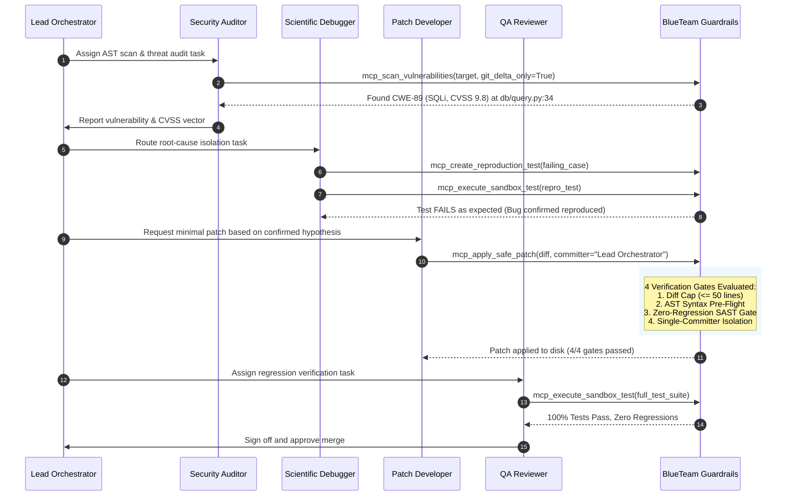

# BlueTeamAgent

<p align="center">
  <strong>Defensive Security Guardrails & Multi-Agent DAG Orchestration Server</strong><br>
  <em>Standard Model Context Protocol (MCP) JSON-RPC 2.0 implementation for secure vulnerability remediation, air-gapped binary triage, and zero-regression patch verification.</em>
</p>

<p align="center">
  <a href="https://github.com/LoveCookieee-java/CookieCyberTeam"></a>
  <a href="https://python.org"></a>
  <a href="#verification--testing"></a>
  <a href="#system-architecture"></a>
  <a href="#safety-invariants--policies"></a>
  <a href="LICENSE"></a>
</p>

---

### Navigation
[Overview](#overview) • [Why BlueTeamAgent](#the-problem--why-blueteamagent) • [Architecture](#system-architecture) • [Remediation Lifecycle](#autonomous-remediation-lifecycle) • [The 4 Guardrails](#the-4-patching-guardrails) • [MCP Interface](#mcp-interface-reference) • [Toolchain](#toolchain--dependencies) • [Configuration](#configuration) • [Testing](#verification--testing)

---

## Overview

When LLMs attempt to fix security vulnerabilities or debug complex codebases, they routinely introduce new bugs, modify unrelated files, generate non-minimal patches, and hallucinate invalid syntax. When analyzing malware, unconstrained agents risk executing malicious binaries directly on host environments.

**BlueTeamAgent** is a defensive Model Context Protocol (MCP) server that interfaces with LLM clients (Cursor, Claude Code, Windsurf, Antigravity) to enforce deterministic engineering guardrails. It packages static analysis scanners, air-gapped binary inspection, sandboxed test execution, and multi-agent orchestration into standard MCP tools, resources, and prompts.

---

## The Problem & Why BlueTeamAgent

| Risk / Failure Mode in Unconstrained LLMs | BlueTeamAgent Defensive Guardrail | Verification Mechanism |
| :--- | :--- | :--- |
| **Guesswork Debugging**<br>LLM modifies code based on assumptions without confirming root causes. | **Hypothesis-Driven Workflow**<br>Requires a minimal reproduction test case that fails before any patch is accepted. | Subprocess/Docker sandbox execution via `mcp_execute_sandbox_test`. |
| **Patch Hallucination & Scope Creep**<br>LLM rewrites 200+ lines, breaking unrelated features and coding conventions. | **Enforced Diff Cap**<br>Hard limit of $\le 50$ modified lines per patch. | Diff parsing in `core/guardrails.py` rejects bloated modifications. |
| **Regression Vulnerabilities**<br>Fixing one issue (e.g. XSS) introduces another (e.g. SQL Injection or command execution). | **Zero-Regression SAST Gate**<br>Compares AST findings before and after patching; blocks any new or duplicated CWE findings. | Pure-Python AST analyzer (`core/ast_scanner.py`) + Semgrep CLI. |
| **Accidental Host Compromise**<br>Agent executes an untrusted binary or malware sample to "inspect" its behavior. | **Zero-Execution Policy**<br>Only passive binary triage (PE/ELF headers, section entropy, string IOC offsets) is allowed on host. | `core/binary_triage.py` parses file structures without executing payloads. Dynamic detonation is isolated to external CAPEv2 sandboxes. |
| **Destructive Actions**<br>Agent runs `rm`, `del`, or `git clean` to "clean up" directories. | **Absolute File Deletion Prohibition**<br>Destructive file operations are strictly barred. All changes must be targeted unified diffs. | Patch manager rejects deletions and limits writes to single-file unified diffs. |

---

## System Architecture

```
┌────────────────────────────────────────────────────────────────────────┐
│           LLM Client (Cursor / Claude Code / Windsurf / AGY)           │
└───────────────────────────────────┬────────────────────────────────────┘
                                    │ JSON-RPC 2.0 (stdio)
                                    ▼
┌────────────────────────────────────────────────────────────────────────┐
│                        BlueTeamAgent MCP Server                        │
├───────────────────────────────────┬────────────────────────────────────┤
│ MCP Tools (Execution)             │ MCP Resources (Context & State)    │
│ • mcp_scan_vulnerabilities        │ • mcp://rules/security-standards   │
│ • mcp_execute_sandbox_test        │ • mcp://rules/debugging-mindset    │
│ • mcp_create_reproduction_test    │ • mcp://state/agent-context        │
│ • mcp_apply_safe_patch            │ • mcp://state/tool-index           │
│ • mcp_orchestrate_dag             │ • mcp://playbooks/malware-triage   │
│ • mcp_search_code                 │ • mcp://playbooks/compromise-...   │
│ • mcp_triage_binary               ├────────────────────────────────────┤
│ • mcp_run_diagnostic_tool         │ MCP Prompts (Agent Personas)       │
│ • mcp_submit_dynamic_sandbox      │ • mcp_prompt_orchestrator          │
├───────────────────────────────────┤ • mcp_prompt_security_audit        │
│ Core Engines                      │ • mcp_prompt_hypothesis_debug      │
│ • AST SAST Scanner (Python/Semgrep) • mcp_prompt_safe_patch            │
│ • 4-Gate Patch Guardrails Engine  │ • mcp_prompt_qa_review             │
│ • DAG Engine & FIPA ACL Mailbox   │ • mcp_prompt_soc_incident_...      │
│ • Binary Triage & CAPEv2 Client   │                                    │
└───────────────────────────────────┴────────────────────────────────────┘
```

---

## Autonomous Remediation Lifecycle

The following sequence illustrates how specialized agent personas interact through the MCP server during a vulnerability remediation task:



---

## The 4 Patching Guardrails

Every file modification dispatched to `mcp_apply_safe_patch` must pass all four gates simultaneously:

```
Proposed Diff ──► [Gate 1: Diff Cap <= 50]
                         │ Pass
                         ▼
                  [Gate 2: AST Syntax Pre-Flight]
                         │ Pass
                         ▼
                  [Gate 3: Zero-Regression SAST]
                         │ Pass
                         ▼
                  [Gate 4: Single-Committer Check] ──► Patch Applied to Disk
```

### Gate Breakdown

1. **Diff Cap Gate ($\le 50$ lines changed)**:
   Calculates total modified lines (`lines_added + lines_removed`). Prevents unconstrained refactoring, file wipes, and hallucinated logic.
2. **AST Syntax Pre-Flight Gate**:
   Runs `ast.parse()` on candidate content prior to disk writes. Completely prevents syntax errors or malformed source trees.
3. **Zero-Regression SAST Gate**:
   Performs an AST analysis of both original and candidate files. Rejects the patch if finding counts increase or new CWEs are introduced.
4. **Single-Committer Gate**:
   Enforces that commits can only be authored under the `Lead Orchestrator` role, eliminating race conditions when multiple agents work concurrently.

#### Example: Patch Evaluation Response

```json
{
  "status": "success",
  "file_path": "backend/auth.py",
  "gates_passed": [
    "diff_cap (14 <= 50 lines)",
    "syntax_preflight (ast.parse passed)",
    "zero_regression_sast (findings: 1 -> 0, zero new CWEs)",
    "single_committer (Lead Orchestrator)"
  ],
  "stats": {
    "lines_added": 9,
    "lines_removed": 5,
    "total_modified": 14
  }
}
```

#### Example: Blocked Patch Response (Regression Caught)

```json
{
  "status": "rejected",
  "gate_failed": "zero_regression_sast",
  "file_path": "backend/auth.py",
  "reason": "Patch introduces 1 new vulnerability: CWE-78 Command Injection at line 42 (subprocess.Popen with shell=True)."
}
```

---

## Core Capabilities

### 1. AST Vulnerability Scanner (`core/ast_scanner.py`)
- **Coverage**: OWASP Top 10 & CWE Top 25 (SQLi CWE-89, Command Injection CWE-78, Hardcoded Secrets CWE-798, Insecure Deserialization CWE-502, Path Traversal CWE-22, Weak Hashes CWE-327/328, Insecure Temporary Files CWE-377, Missing CSRF CWE-352).
- **Import Aliasing**: Resolves disguised imports (`import os as my_os`, `from subprocess import Popen as run_proc`).
- **Local Taint Analysis**: Propagates taint across variable assignments, concatenated strings, walrus operators (`NamedExpr`), and function calls.
- **Git Delta Scanning**: Scans only modified lines for PRs or commits (`git_delta_only=True`), reducing scan time and eliminating noise from legacy code.

### 2. Air-Gapped Static Binary Triage (`core/binary_triage.py`)
- **Zero-Execution Guarantee**: Analyzes binaries purely through passive byte parsing.
- **Format Identification**: Magic byte parsing for PE/PE32+, ELF32/64, Mach-O (32-bit, 64-bit, FAT Universal), Android DEX, ZIP, and TAR.
- **PE Structural Inspection**: Traverses Section Table Headers, calculates virtual vs. raw size anomalies, and flags **$W \oplus X$** permission violations (`IMAGE_SCN_MEM_EXECUTE | IMAGE_SCN_MEM_WRITE`).
- **Section & Block Entropy**: Calculates Shannon entropy across 1KB blocks ($0.0 \le H \le 8.0$) to detect packed code, encrypted payloads, and UPX sections.
- **Evidence Chain**: Extracts URLs, IPs, domains, and suspicious API imports along with exact byte hexadecimal file offsets (`0x00001a40`).

#### Example: Binary Triage Findings

```json
{
  "status": "success",
  "file_type": "PE32+ executable (x86-64)",
  "hashes": {
    "sha256": "8f3b2a...e419",
    "md5": "d41d8c...0021"
  },
  "sections": [
    {"name": ".text", "virtual_size": 40960, "raw_size": 40960, "entropy": 6.38, "executable": true, "writable": false},
    {"name": "UPX0",  "virtual_size": 98304, "raw_size": 0,     "entropy": 0.00, "executable": true, "writable": true, "anomaly": "W^X violation"},
    {"name": "UPX1",  "virtual_size": 49152, "raw_size": 49152, "entropy": 7.89, "executable": true, "writable": true, "anomaly": "High entropy (Packed)"}
  ],
  "evidence_chain": [
    {"type": "URL", "value": "http://192.168.1.100:8080/c2_beacon", "offset_hex": "0x00004a10"},
    {"type": "Suspicious_API", "value": "VirtualAllocEx", "offset_hex": "0x00005120"}
  ]
}
```

### 3. Dynamic Sandbox Bridge (`core/cape_adapter.py`)
- For behavioral detonation, BlueTeamAgent provides an HTTP REST client for **CAPEv2** and **Cuckoo Sandbox**.
- Safely submits samples to dedicated guest analysis machines (Windows 10/11 VMs), polls execution status, and returns network traffic PCAPs, injected API call traces, and dropped payloads.

### 4. Multi-Agent DAG Task Scheduler (`core/dag_engine.py`)
- Directed Acyclic Graph scheduler with topological sorting via `graphlib.TopologicalSorter`.
- Pre-commit dependency validation prevents circular deadlocks.
- Point-to-point agent mailbox system with **Max Hop TTL = 20** to eliminate infinite ping-pong loops while enabling deep collaboration.
- Persistent SQLite WAL backend (`.cookiegli/agent_state.db`) with automatic recovery hooks for orphaned tasks.

### 5. Token-Efficient Code Search (`core/code_search.py`)
- Syntactic AST chunking extracts functions, classes, and declarations instead of dumping full files into LLM context windows, reducing token overhead by up to 98%.
- Persistent SQLite FTS5 disk cache with file `mtime` indexing and BM25 ranking.

---

## Safety Invariants & Policies

```
┌────────────────────────────────────────────────────────────────────────┐
│                      MANDATORY SAFETY INVARIANTS                       │
├────────────────────────────────────────────────────────────────────────┤
│ 1. ZERO-EXECUTION POLICY                                               │
│    Untrusted binaries are never executed directly on the host system.  │
│    Dynamic execution must route to Tier-2 Docker or external CAPEv2.   │
├────────────────────────────────────────────────────────────────────────┤
│ 2. ABSOLUTE PROHIBITION OF FILE DELETION                               │
│    Commands like rm, del, rmdir, Remove-Item, unlink, and git clean   │
│    are strictly forbidden. Modifications must use unified diffs.       │
├────────────────────────────────────────────────────────────────────────┤
│ 3. HOST PROCESS & ENVIRONMENT ISOLATION                                │
│    Subprocess executions use strict argv lists, strip host credentials │
│    via whitelist, and terminate entire process trees on timeout.       │
└────────────────────────────────────────────────────────────────────────┘
```

---

## MCP Interface Reference

### Tools (9 Tools)

| Tool | Description | Key Parameters |
| :--- | :--- | :--- |
| `mcp_scan_vulnerabilities` | AST SAST analysis for CWEs with CVSS v3.1 scoring and Git delta filtering. | `target_path`, `git_delta_only`, `use_semgrep` |
| `mcp_execute_sandbox_test` | Executes unit or reproduction tests in an isolated subprocess or Docker container. | `test_file`, `test_args`, `sandbox_type`, `timeout` |
| `mcp_create_reproduction_test` | Generates a minimal reproduction test file that must fail before a patch is written. | `target_module`, `reproduction_code`, `test_name` |
| `mcp_apply_safe_patch` | Applies a unified patch verified by the 4-gate safety engine. | `file_path`, `patch_diff`, `committer` |
| `mcp_orchestrate_dag` | Coordinates multi-agent DAG tasks, status transitions, and mailbox messaging. | `action`, `task_id`, `recipient`, `message_content` |
| `mcp_search_code` | Syntactic AST chunk code search powered by SQLite FTS5 BM25 ranking. | `query`, `target_dir`, `extensions`, `limit` |
| `mcp_triage_binary` | Air-gapped static inspection of binaries (PE/ELF/Mach-O, W^X, Shannon entropy, IOCs). | `file_path`, `max_bytes` |
| `mcp_run_diagnostic_tool` | Executes whitelisted host reverse-engineering CLI tools under strict argv sanitization. | `tool_name`, `target_file`, `args` |
| `mcp_submit_dynamic_sandbox` | Submits binary to external CAPEv2/Cuckoo sandbox via REST API and returns execution reports. | `file_path`, `timeout` |

### Resources (6 Resources)

| Resource URI | Description |
| :--- | :--- |
| `mcp://rules/security-standards` | OWASP Top 10 & CWE Top 25 standards, CVSS scoring guidelines, and secure coding practices. |
| `mcp://rules/debugging-mindset` | 4-step scientific debugging methodology: Reproduce -> Trace -> Hypothesize -> Confirm. |
| `mcp://state/agent-context` | SQLite WAL state containing active DAG tasks, dependency graphs, findings, and mailboxes. |
| `mcp://state/tool-index` | Dynamic catalog of detected host analysis tools (Semgrep, Radare2, Ghidra, JADX, CFR, Docker). |
| `mcp://playbooks/malware-triage` | NIST SP 800-61 Rev 3 static triage operating procedures. |
| `mcp://playbooks/compromise-assessment` | Incident containment, log correlation, and post-compromise remediation steps. |

### Prompts (6 Prompts)

| Prompt Name | Persona / Role | Focus Area |
| :--- | :--- | :--- |
| `mcp_prompt_orchestrator` | Lead Orchestrator | DAG decomposition, dependency scheduling, single-committer patch sign-off. |
| `mcp_prompt_security_audit` | Security Auditor | Attack surface mapping, STRIDE threat modeling, and SAST vulnerability scanning. |
| `mcp_prompt_hypothesis_debug` | Scientific Debugger | Minimal reproduction test generation, stack trace analysis, and root-cause hypothesis validation. |
| `mcp_prompt_safe_patch` | Patch Developer | Minimal diff patch generation ($\le 50$ lines) addressing confirmed root causes. |
| `mcp_prompt_qa_review` | QA Reviewer | Isolated test execution, regression verification, and patch sign-off. |
| `mcp_prompt_soc_incident_responder` | SOC Analyst | MITRE ATT&CK log correlation, binary IOC extraction, and containment playbooks. |

---

## Toolchain & Dependencies

BlueTeamAgent implements a **Two-Tier Capability Model**:

- **Tier 1 (Core Runtime - Zero External Dependencies)**: Standard Python 3.9+ standard library (`ast`, `sqlite3`, `subprocess`, `hashlib`, `math`, `urllib`). Everything works out-of-the-box on fresh environments.
- **Tier 2 (External Accelerators - Optional)**: When installed in system `PATH`, BlueTeamAgent automatically discovers and leverages them:

```bash
# Multi-language SAST (JavaScript, TypeScript, Go, Java, C/C++)
pip install semgrep

# Embedding-based code search
pip install semble

# Binary disassembly & reverse engineering
# Windows: winget install radareorg.radare2
# macOS:   brew install radare2
# Linux:   sudo apt install radare2 binutils

# Java & Android bytecode decompilation
# Windows: choco install jadx
# macOS:   brew install jadx cfr
```

---

## Configuration

### MCP Client Integration

Add BlueTeamAgent to your client configuration (e.g. `claude_desktop_config.json`, Windsurf, or Cursor):

```json
{
  "mcpServers": {
    "blue-team-security": {
      "command": "python",
      "args": ["/path/to/BlueTeamAgent/server.py", "--stdio"],
      "env": {
        "CAPE_API_URL": "https://cape.example.internal",
        "CAPE_API_KEY": "optional-api-token"
      }
    }
  }
}
```

### Environment Variables

| Variable | Description | Default |
| :--- | :--- | :--- |
| `CAPE_API_URL` | Base URL of CAPEv2 or Cuckoo Sandbox REST API. | `None` (dynamic submission returns configuration advisory) |
| `CAPE_API_KEY` | Bearer/token credential for CAPEv2 API authentication. | `None` |
| `DOCKER_HOST` | Docker daemon endpoint for Tier-2 container isolation. | System default |

---

## Verification & Testing

The test suite contains **123 automated unit tests** verifying all scanners, calculators, sandboxes, guardrails, and adapters with a 100% pass rate.

```bash
# Run server diagnostic self-test
python server.py --test-mode

# Run full unittest suite
python -m unittest discover -s tests -v

# Run MCP server over stdio
python server.py --stdio
```

```
=== Blue Team MCP Server Self-Test ===
[PASS] Tools verified: 9 registered
[PASS] Resources verified: 6 registered and readable
[PASS] Prompts verified: 6 registered and formatted
[PASS] JSON-RPC initialization handshake verified
[PASS] Vulnerability Scan tool verified: Caught CWE-78 (CVSS 9.8)
[PASS] DAG Engine & Mailbox verified: 5-worker pipeline created
[PASS] Hybrid Code Search tool verified: 3 matches found
[PASS] Air-Gapped Binary Triage verified: PE recognized, URL IOC caught
[PASS] Diagnostic Tool runner verified: Whitelist enforcement operational
[PASS] Dynamic Sandbox tool verified: Graceful fallback operational
----------------------------------------------------------------------
Ran 123 tests in 2.603s
OK (100% Passed, 0 Failures, 0 Errors)
```

---

## Project Structure

```
BlueTeamAgent/
├── server.py                 # MCP server entry point (JSON-RPC stdio dispatcher)
├── core/
│   ├── ast_scanner.py        # AST SAST engine, taint tracker, entropy detector
│   ├── binary_triage.py      # Air-gapped static binary inspection & PE parser
│   ├── cape_adapter.py       # CAPEv2 / Cuckoo REST API dynamic sandbox bridge
│   ├── code_search.py        # AST syntactic chunking & SQLite FTS5 search
│   ├── cvss_calculator.py    # FIRST CVSS v3.1 vector parser & scoring
│   ├── dag_engine.py         # Multi-agent DAG task scheduler & mailbox
│   ├── guardrails.py         # 4-gate safe patch validation engine
│   ├── sandbox_runner.py     # Subprocess & Docker isolated test execution
│   ├── semgrep_adapter.py    # Multi-language external SAST bridge
│   ├── soc_rules.py          # Dynamic SOC detection rules & MITRE ATT&CK mapping
│   └── tool_indexer.py       # Host reverse-engineering toolchain catalog & runner
├── tests/                    # 123 automated unit tests (100% pass rate)
└── .agents/                  # Autonomous rulesets and architecture genomes
```

## License

Apache License 2.0. See [LICENSE](LICENSE) for details.
