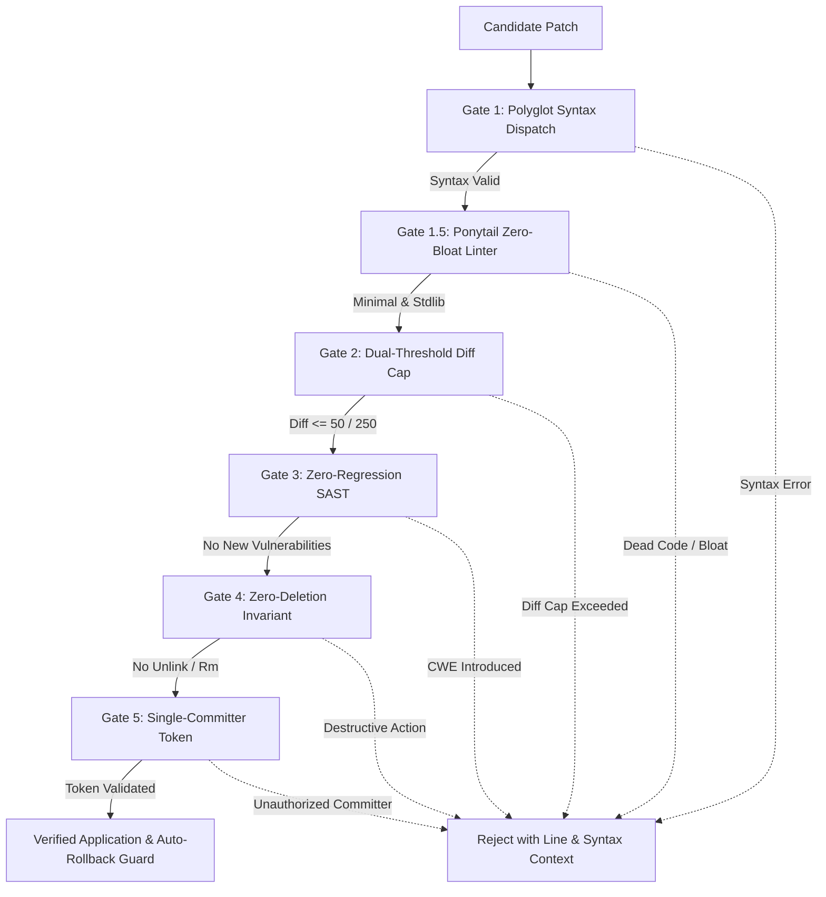

<p align="center">
  
</p>

# CookieCyberTeam

<p align="center">
  <strong>Single Unified Intelligent MCP Server, Defensive Guardrails & Autonomous Cyber Defense System</strong><br>
  <em>Next-generation Model Context Protocol (MCP) JSON-RPC 2.0 server enforcing deterministic engineering guardrails, inter-procedural taint flow analysis, air-gapped binary triage, and zero-regression safe patching for autonomous AI coding agents.</em>
</p>

<p align="center">
  <a href="https://smithery.ai/server/@LoveCookieee-java/CookieCyberTeam"></a>
  <a href="https://pypi.org/project/cookie-cyber-team/"></a>
  <a href="https://github.com/LoveCookieee-java/CookieCyberTeam/actions"></a>
  <a href="https://python.org"></a>
  <a href="#verification--benchmarks"></a>
  <a href="#system-architecture"></a>
  <a href="#the-5-patching-guardrails"></a>
  <a href="LICENSE"></a>
</p>

---

### Quick Navigation
[⚡ Quickstart (5s)](#-quickstart-zero-install-in-5-seconds) • [Overview](#overview) • [The Problem & Solution](#the-problem-why-cookiecyberteam) • [System Architecture](#system-architecture) • [Project Genome Profiler](#project-genome-profiler--adaptive-meta-guide) • [The 5 Guardrail Gates](#the-5-patching-guardrails) • [Ponytail Principle](#ponytail-principle-the-lazy-senior-dev-mindset--native-playbook) • [MCP Interface (19 Tools)](#mcp-interface-reference) • [Offline SCA & Binary Triage](#air-gapped-binary-triage--quarantine-vault) • [CLI & Pre-Commit](#standalone-headless-cli--pre-commit-hook) • [Configuration](#configuration) • [Verification](#verification--benchmarks)

---

## ⚡ Quickstart (Zero-Install in 5 Seconds)

### 1. Zero-Install via `uvx` (Claude Desktop, Cursor, Windsurf)
Add to your `claude_desktop_config.json`, `.cursor/mcp.json`, or Windsurf MCP configuration:

```json
{
  "mcpServers": {
    "cookie-cyber-team": {
      "command": "uvx",
      "args": ["cookie-cyber-team", "--stdio"]
    }
  }
}
```

### 2. 1-Click Install via Smithery
For Claude Code CLI or Claude Desktop:
```bash
npx -y @smithery/cli install @LoveCookieee-java/CookieCyberTeam --client claude
```

### 3. Standalone CLI & Pre-Commit Hook (No Clone Required)
Run instant security scans without cloning or installing dependencies:
```bash
# Run one-off vulnerability scan on current directory
uvx --from cookie-cyber-team cookiecyber scan . --fail-on high

# Or integrate into your .pre-commit-config.yaml
repos:
  - repo: https://github.com/LoveCookieee-java/CookieCyberTeam
    rev: v1.0.2
    hooks:
      - id: cookiecyber-scan
        args: ["--fail-on", "high"]
```

## Overview

When autonomous LLM agents (Cursor, Claude Code, Windsurf, Antigravity) attempt to fix vulnerabilities or modify production codebases, they frequently introduce regressions, hallucinate non-existent APIs, over-engineer changes, or inadvertently execute destructive shell commands (`rm`, `del`, `unlink`). Furthermore, during security investigations, unconstrained agents can accidentally trigger malware payloads on the host environment.

**CookieCyberTeam** is a defensive Model Context Protocol (MCP) server engineered to solve these failure modes. Built on pure Python standard library foundations with zero mandatory external runtime dependencies, it provides:

1. **A Single Unified Intelligent MCP Server**: Replaces tool bloat with a dynamic **Project Genome Profiler (< 5ms)** and an **Adaptive Meta-Guide** that acts as an LLM Cognitive Anchor.
2. **5-Gate Safe Patching Pipeline**: Strictly enforces polyglot syntax validation, Ponytail minimalism (stdlib-first, zero dead code), a dual-threshold diff cap ($\le 50$ modified lines), zero-regression inter-procedural SAST, and an absolute zero-deletion invariant.
3. **Inter-Procedural Call Graph & Taint Engine**: Tracks taint flow across intra- and inter-procedural call boundaries across 17 CWE categories with FIRST CVSS v3.1 and v4.0 scoring.
4. **Air-Gapped Static Binary Triage & Quarantine Vault**: Inspects PE, ELF, Mach-O, and DEX headers ($W \oplus X$ violation detection, 1KB Shannon entropy curve, byte-exact IOC offsets) without host execution risk, paired with XOR-encrypted quarantine primitives.
5. **Multi-Agent DAG Task Scheduler & FIPA-ACL Mailbox**: Orchestrates multi-agent incident response pipelines with point-to-point messaging, inbox drainage checks, and automatic orphaned task recovery.

---

## The Problem: Why CookieCyberTeam

| Vulnerability / Failure Mode in Autonomous LLMs | CookieCyberTeam Defensive Engine | Verification & Enforcement Mechanism |
| :--- | :--- | :--- |
| **Tool Overload & Context Bloat**<br>Installing 5+ MCP servers exposes 70+ tool schemas, burning 15K tokens per turn and causing tool hallucination. | **Project Genome Profiler + Adaptive Meta-Guide**<br>Dynamic sub-5ms environment discovery recommends the exact 2–4 tools needed for the user's intent. | Dynamic JSON genome (`mcp://context/project-genome`) and cognitive anchor (`mcp_adaptive_guide`). |
| **Guesswork & Hallucinated Fixes**<br>LLM modifies source code based on guesses without proving the root cause or validating reproductions. | **Hypothesis-Driven Debugging Workflow**<br>Mandates reproducing the failure with a minimal test case before authoring or accepting patches. | Subprocess/Docker sandbox execution via `mcp_execute_sandbox_test` and `mcp_create_reproduction_test`. |
| **Scope Creep & Over-Engineering**<br>LLM rewrites hundreds of lines, introduces dead code, or adds heavy third-party dependencies for simple tasks. | **Dual Diff Cap & Ponytail Linter (Gate 1.5 & 2)**<br>Hard cap of $\le 50$ modified lines ($\le 250$ for new scaffolding), dead code check (YAGNI), and stdlib priority. | AST analysis and hunk parser in `core/guardrails.py` reject bloated diffs. |
| **Regression Vulnerabilities**<br>Fixing an existing bug introduces a new CWE (e.g., SQLi, Command Injection, SSRF, Deserialization). | **Zero-Regression Inter-Procedural SAST (Gate 3)**<br>Compares AST findings before and after patching; blocks any new or duplicated CWE findings across 17 categories. | Inter-procedural call graph visitor (`core/ast_scanner.py`) + optional Semgrep adapter. |
| **Accidental Host Compromise**<br>Agent executes an untrusted binary or sample to "inspect its output" or "check dependencies". | **Air-Gapped Zero-Execution Policy**<br>Passive structural inspection only. Prohibits launching binary samples on host runtime. | Structural byte parsing in `core/binary_triage.py`. Live detonation restricted to external isolated sandboxes. |
| **Destructive Actions**<br>Agent runs destructive commands (`rm`, `del`, `unlink`, `shutil.rmtree`) to clean or organize files. | **Absolute Zero-Deletion Invariant (Gate 4)**<br>Destructive file operations are strictly barred. Quarantine uses atomic byte scrambling. | AST/token scanning rejects destructive primitives. Relocation uses `os.replace` after XOR encryption. |

---

## System Architecture

```
┌────────────────────────────────────────────────────────────────────────┐
│           LLM Client (Cursor / Claude Code / Windsurf / AGY)           │
└───────────────────────────────────┬────────────────────────────────────┘
                                    │ JSON-RPC 2.0 (stdio / SSE)
                                    ▼
┌────────────────────────────────────────────────────────────────────────┐
│                      CookieCyberTeam MCP Server                        │
│                                                                        │
│ ┌──────────────────────────────────┐ ┌───────────────────────────────┐ │
│ │  MCP Tools (19 Tools)            │ │  MCP Resources (9 Resources)  │ │
│ │  • mcp_adaptive_guide (Genome)   │ │  • mcp://context/genome       │ │
│ │  • mcp_scan_vulnerabilities      │ │  • mcp://rules/active-gates   │ │
│ │  • mcp_search_code (Semble FTS5) │ │  • mcp://rules/standards      │ │
│ │  • mcp_audit_dependencies (SCA)  │ │  • mcp://rules/debugging      │ │
│ │  • mcp_create_reproduction_test  │ │  • mcp://rules/ponytail-ladder│ │
│ │  • mcp_execute_sandbox_test      │ │  • mcp://state/agent-context  │ │
│ │  • mcp_preview_surgical_patch    │ │  • mcp://state/tool-index     │ │
│ │  • mcp_apply_safe_patch (Roll)   │ │  • mcp://playbooks/triage     │ │
│ │  • mcp_triage_binary (Air-Gap)   │ │  • mcp://playbooks/ir         │ │
│ │  • mcp_run_diagnostic_tool       ├─┴───────────────────────────────┤ │
│ │  • mcp_submit_dynamic_sandbox    │  MCP Prompts (8 Personas)       │ │
│ │  • mcp_quarantine_artifact       │  • Lead Orchestrator            │ │
│ │  • mcp_restore_quarantined_file  │  • Security Auditor             │ │
│ │  • mcp_generate_containment_rule │  • Hypothesis Debugger          │ │
│ │  • mcp_terminate_process         │  • Patch Developer              │ │
│ │  • mcp_orchestrate_dag (Mailbox) │  • QA / Code Reviewer           │ │
│ │  • mcp_ponytail_review           │  • SOC Incident Responder       │ │
│ │  • mcp_ponytail_audit            │  • Ponytail Pragmatic Reviewer  │ │
│ │  • mcp_ponytail_debt             │  • Ponytail Minimalist Dev      │ │
│ └──────────────────────────────────┘ └───────────────────────────────┘ │
├────────────────────────────────────────────────────────────────────────┤
│ Core Defensive Engines                                                 │
│ • Project Genome Profiler: Sub-5ms language, framework & runner probe  │
│ • 5-Gate Safe Patch Engine: Hunk JSON + Unified Diff + Auto-Rollback   │
│ • Ponytail Engine: 7-Rung ladder, AST YAGNI pruner, stdlib priority    │
│ • Inter-Procedural SAST: Call graph taint propagation for 17 CWEs      │
│ • Semble Code Search: Syntactic AST chunking + SQLite FTS5 BM25        │
│ • Supply Chain SCA: Offline OSV vulnerability matcher for pyproject    │
│ • Binary Triage: Air-gapped PE/ELF/Mach-O/DEX structural inspector     │
│ • Containment Engine: Netsh, iptables, UFW, and XOR-scrambled vault    │
│ • DAG Engine: Directed Acyclic Graph runner + FIPA-ACL mailbox         │
└────────────────────────────────────────────────────────────────────────┘
```

---

## Project Genome Profiler & Adaptive Meta-Guide

Instead of burdening the agent's context window with dozens of generic tools, CookieCyberTeam introduces a cognitive anchoring pattern:

```
[Agent Task Start] ──► [mcp_adaptive_guide] ──► Inspects Repo (< 5ms)
                                                       │
         ┌─────────────────────────────────────────────┴─────────────────────────────────────────────┐
         ▼                                             ▼                                             ▼
  [Language & Stack]                           [Active Guardrails]                           [Targeted Action]
  • Python / TypeScript / Go                   • Diff Cap: <= 50 lines                       • Recommended 2-4 tools
  • FastAPI / Django / React                   • Ponytail Linter: Active                     • Exact test command lines
  • Test runner: pytest / unittest             • Zero-Deletion: Strictly Enforced            • Prohibited destructive ops
```

### Discovery Capabilities (< 5ms, Pure Python stdlib)
- **Primary Languages**: Python, TypeScript, JavaScript, Go, Rust, Java, C, C++.
- **Frameworks**: FastAPI, Django, Flask, Express, Next.js, React, Spring Boot.
- **Test Runners**: `pytest`, `unittest`, `jest`, `cargo test`, `go test`.
- **Git Context**: Current branch, dirty worktree status, protected branch detection (`main`, `master`, `prod`).
- **Host Diagnostic Toolchain**: `docker`, `semgrep`, `r2`, `ghidra`, `cfr`, `jadx`, `strings`, `objdump`, `readelf`.

---

## The 5 Patching Guardrails

Every patch processed by `mcp_apply_safe_patch` or verified via `mcp_preview_surgical_patch` must pass all five gates sequentially. Failure at any gate triggers an immediate rejection with actionable diagnostic remediation.



### Gate Breakdown

1. **Gate 1: Polyglot Syntax Dispatch**:
   - Python: Strict `ast.parse()` validation.
   - JSON: RFC 8259 validation via `json.loads()`.
   - YAML: Safe YAML parsing with comment and scalar apostrophe tolerance.
   - Polyglot (JS/TS/Go/Java/C/C++): Pure-Python comment-aware delimiter stack checking (`()`, `[]`, `{}`) and balanced template string interpolations `${...}`.
2. **Gate 1.5: Ponytail Zero-Bloat Linter**:
   - **Dead Code Check (YAGNI)**: Rejects functions/classes with zero call sites in the codebase or tests (unless exported in `__all__`).
   - **Stdlib Prioritization**: Flags third-party imports when Python standard library equivalents exist, unless already pinned in repository manifests.
3. **Gate 2: Dual-Threshold Diff Cap**:
   - $\le 50$ modified lines for edits to existing files.
   - $\le 250$ lines for new scaffolding or test fixture generation.
4. **Gate 3: Zero-Regression Inter-Procedural SAST**:
   - Scans code before and after patching across 17 CWEs.
   - Blocks new CWE types and prevents duplicate finding counts (`patched_counts[cwe] > orig_counts[cwe]`).
   - Call graph visitor discriminates sink types (`sql`, `command`, `path`, `ssrf`, `deserialization`) to prevent cross-procedural false positives.
5. **Gate 4: Absolute Zero-Deletion Invariant**:
   - Strictly blocks `os.remove`, `os.unlink`, `shutil.rmtree`, `rmdir`, and shell deletion commands (`rm`, `del`, `Remove-Item`).
   - Quarantined artifacts are XOR-scrambled and atomically moved via `os.replace`.
6. **Gate 5: Single-Committer Isolation**:
   - Validates ephemeral capability session tokens issued exclusively to `Lead Orchestrator` to prevent concurrent write collisions.

---

## Ponytail Principle: The Lazy Senior Dev Mindset & Native Playbook

CookieCyberTeam incorporates the [DietrichGebert/ponytail](https://github.com/dietrichgebert/ponytail) philosophy to combat agentic over-engineering, code bloat, and dependency sprawl.

### The 7-Rung Decision Ladder
Every code modification is vetted against 7 sequential rungs:
1. **Does this need to exist?** (YAGNI) — Reject speculative features, premature abstractions, and dead scaffolding.
2. **Can existing code solve this?** — Maximize reuse of existing functions, helpers, and utilities.
3. **Does the standard library do this?** — Reject unnecessary 3rd-party dependencies when stdlib equivalents exist.
4. **Does an existing project dependency solve this?** — Prevent duplicate or overlapping libraries.
5. **Shortest working diff wins** — Prioritize concise root-cause fixes over superficial wrapper functions.
6. **Lazy, not negligent** — Never compromise security, input validation, authentication, or error handling.
7. **Leave the campsite cleaner** — Prune dead code, remove unused imports, and eliminate unused symbols.

### Ponytail Intensity Modes & Guardrail Diff Caps
Configured via `.cookiecyber.toml` or `cookiecyber.json`:

| Intensity Mode | Modification Diff Cap | Scaffolding Diff Cap | Ponytail Linter | Recommended Use Case |
| :--- | :--- | :--- | :--- | :--- |
| `ultra` | **25 lines** | 150 lines | Active (Strict AST YAGNI) | Surgical bugfixes, hotfixes, critical security patches |
| `full` *(default)* | **50 lines** | 250 lines | Active | Standard feature work, maintenance, refactoring |
| `lite` | **80 lines** | 400 lines | Active | Initial module scaffolding, large-scale migrations |
| `off` | Unlimited | Unlimited | Disabled | Unconstrained exploratory coding |

### Polyglot Native / Stdlib Equivalents Reference
- **Python**: `requests` ➔ `urllib.request`, `pytz` ➔ `zoneinfo`, `simplejson` ➔ `json`, `mock` ➔ `unittest.mock`, `python-dateutil` ➔ `datetime`, `attrs` ➔ `dataclasses`, `six` ➔ stdlib Python 3, `pathlib2` ➔ `pathlib`.
- **JavaScript / TypeScript**: `lodash`/`underscore` ➔ native ES6+ (`map`, `filter`, `reduce`, `Object.assign`), `moment`/`dayjs` ➔ `Intl.DateTimeFormat` / `Temporal`, `axios`/`node-fetch` ➔ native `fetch()`, `chalk` ➔ `node:util.styleText()`, `rimraf` ➔ `fs.rmSync(path, {recursive: true})`, `mkdirp` ➔ `fs.mkdirSync(path, {recursive: true})`.

---

## MCP Interface Reference

### Tools (19 Tools)

| Tool Name | Scope & Purpose | Key Parameters |
| :--- | :--- | :--- |
| `mcp_adaptive_guide` | Dynamic cognitive anchor providing optimal tool sequence and constraints. | `task_intent`, `active_file` |
| `mcp_scan_vulnerabilities` | Inter-procedural AST SAST analysis across 17 CWEs with FIRST CVSS v3.1/v4.0 scoring. | `target_path`, `code_content`, `delta_only`, `output_format` |
| `mcp_audit_dependencies` | Offline Software Composition Analysis (SCA) against curated OSV vulnerability database. | `path` |
| `mcp_execute_sandbox_test` | Isolated test execution in Subprocess (argv whitelist) or Docker (`--network none`). | `test_path`, `sandbox_type`, `timeout` |
| `mcp_create_reproduction_test` | Enforces Hypothesis-Driven step 1: scaffolds a minimal failing reproduction test case. | `save_path`, `test_code`, `vulnerability_type` |
| `mcp_preview_surgical_patch` | Dry-run gate verification returning unified diff preview without disk mutation. | `target_file`, `hunks`, `unified_diff`, `patched_content` |
| `mcp_apply_safe_patch` | Atomic patch application with dual-format hunk/diff parsing and transactional rollback. | `target_file`, `hunks`, `unified_diff`, `committer_token` |
| `mcp_orchestrate_dag` | Multi-Agent DAG workflow management, dependency validation, and FIPA mailbox routing. | `action`, `pipeline_id`, `task_id`, `from_agent`, `to_agent` |
| `mcp_search_code` | Semble-style syntactic AST chunking and SQLite FTS5 BM25 search with disk WAL cache. | `query`, `target_path`, `mode`, `top_k` |
| `mcp_triage_binary` | Air-gapped static structural triage of PE/ELF/Mach-O/DEX binaries ($W \oplus X$, entropy, IOCs). | `file_path` |
| `mcp_run_diagnostic_tool` | Sandboxed host diagnostic tool execution (`strings`, `readelf`, `objdump`, `cfr`, `jadx`, `r2`). | `tool_name`, `target_file`, `args` |
| `mcp_submit_dynamic_sandbox` | Non-blocking submission and polling bridge to external CAPEv2 / Cuckoo sandboxes. | `file_path`, `task_id`, `async_mode` |
| `mcp_quarantine_artifact` | Atomic XOR scrambling (0x5A) and vault relocation of suspicious artifacts. | `file_path`, `quarantine_dir` |
| `mcp_restore_quarantined_file` | Safely decrypts and restores quarantined artifacts with permission recovery. | `quarantine_path`, `original_destination` |
| `mcp_generate_containment_rule` | Generates cross-platform containment firewall rules (Windows netsh, Linux iptables, UFW, DNS). | `target`, `rule_type`, `port` |
| `mcp_terminate_process` | Safe process subtree termination (`taskkill /T` on Windows, process tree signals on POSIX). | `pid`, `timeout` |
| `mcp_ponytail_review` | Reviews code or diff against Ponytail 7-Rung Ladder, tagging findings (`delete:`, `stdlib:`, `native:`, `yagni:`, `shrink:`). | `code`, `file_path`, `diff`, `mode` |
| `mcp_ponytail_audit` | Audits workspace for dead code, unneeded dependencies, and AST YAGNI violations. | `path`, `mode` |
| `mcp_ponytail_debt` | Scans workspace for `ponytail:` debt comments and compiles a structured Debt Ledger. | `path` |

### Resources (9 Resources)

| Resource URI | Description |
| :--- | :--- |
| `mcp://context/project-genome` | Dynamic JSON genome detailing stack, test runners, git status, tools, and risk profile. |
| `mcp://rules/active-guardrails` | Live status and operational thresholds for all 5 security guardrail gates. |
| `mcp://rules/security-standards` | Defensive standards across OWASP Top 10, CWE Top 25, and FIRST CVSS metrics. |
| `mcp://rules/debugging-mindset` | 4-step scientific debugging methodology: Reproduce -> Trace -> Hypothesize -> Confirm. |
| `mcp://rules/ponytail-ladder` | The Lazy Senior Dev Decision Ladder, native polyglot replacements, and intensity modes. |
| `mcp://state/agent-context` | SQLite WAL state containing active DAG tasks, dependency graphs, findings, and mailboxes. |
| `mcp://state/tool-index` | Dynamic catalog of detected host analysis tools (Docker, Semgrep, Radare2, Ghidra, JADX). |
| `mcp://playbooks/malware-triage` | NIST SP 800-61 Rev 3 static triage and evidence preservation procedures. |
| `mcp://playbooks/compromise-assessment` | Incident containment, log correlation, and lateral movement detection playbooks. |

### Prompts (8 Personas)

| Prompt Name | Persona / Role | Key Arguments |
| :--- | :--- | :--- |
| `mcp_prompt_orchestrator` | Lead Orchestrator: DAG decomposition, single-committer gatekeeper | `issue_description`, `target_file` |
| `mcp_prompt_security_audit` | Security Auditor: Attack surface mapping, AST SAST scanning | `target_file` |
| `mcp_prompt_hypothesis_debug` | Scientific Debugger: 4-step mindset, minimal repro test | `vulnerability`, `target_file` |
| `mcp_prompt_safe_patch` | Patch Developer: Minimal diff ($\le 50$ lines), direct root-cause fix | `root_cause`, `target_file` |
| `mcp_prompt_qa_review` | QA / Code Reviewer: Sandboxed verification, zero-regression SAST | `target_file`, `repro_test` |
| `mcp_prompt_soc_incident_responder` | SOC Incident Responder: NIST SP 800-61 Rev 3 air-gapped triage | `incident_description`, `artifact_path` |
| `mcp_prompt_ponytail_review` | Senior Pragmatic Reviewer: 7-Rung ladder code & diff audit | `target_file`, `diff` |
| `mcp_prompt_ponytail_minimalist` | Ponytail Minimalist Dev: Shortest working diff, native stdlib | `task_description`, `target_file`, `mode` |

---

## Air-Gapped Binary Triage & Quarantine Vault

CookieCyberTeam provides a comprehensive static binary triage suite operating under a strict **Zero-Execution Policy**:

```
[Untrusted Binary] ──► [Static Header Parser] ──► Parse Sections (PE / ELF / Mach-O / DEX)
                              │
                              ├──► Detect W^X Violations (IMAGE_SCN_MEM_EXECUTE & WRITE)
                              ├──► 1KB Windowed Shannon Entropy Curve (Detect Packed/Encrypted Data)
                              ├──► Stream SHA-256 / MD5 (usedforsecurity=False)
                              └──► Extract IOCs (IPv4, Domain, URL, API Calls) with Exact Hex Offsets
                                    │
                                    ▼
[Suspicious Artifact] ──► [Zero-Deletion Vault] ──► XOR-0x5A Scramble ──► Atomic Relocation (.quarantine/)
```

- **PE / ELF / Mach-O / DEX Structural Parsing**: Pure-Python unpacking of headers and section tables without external DLL or shared library requirements.
- **$W \oplus X$ Memory Protection Violation Check**: Identifies sections marked simultaneously executable and writable (`IMAGE_SCN_MEM_EXECUTE | IMAGE_SCN_MEM_WRITE`), a hallmark of unpackers, shellcode, and in-memory loaders.
- **Section Entropy Analysis**: Calculates Shannon entropy per section over 1KB sliding blocks to flag packed or encrypted payloads ($\text{Entropy} > 7.2$).
- **Byte-Exact Evidence Chain**: IOCs (IPv4 addresses, C2 domains, URLs) and suspicious Win32/POSIX API imports are reported with their exact file hex offset (e.g., `0x0001a4e0`).
- **Zero-Deletion Containment Vault**: When quarantining, files are scrambled in-place with XOR byte transformations (0x5A) and moved atomically to `.quarantine/` via `os.replace`, strictly respecting the zero-deletion invariant.

---

## Standalone Headless CLI & Pre-Commit Hook

CookieCyberTeam provides a standalone CLI (`core/cli.py`) for automated CI/CD pipelines, local terminal triage, and pre-commit checks:

```bash
# 1. Run SAST security scan with exit-code gating
python -m core.cli scan --path . --format json --fail-on high

# 2. Export OASIS SARIF v2.1.0 for GitHub Code Scanning
python -m core.cli scan --path src/ --format sarif > results.sarif

# 3. Supply chain SCA dependency audit
python -m core.cli audit --path .

# 4. Air-gapped static binary triage
python -m core.cli triage --file suspicious_sample.bin

# 5. Generate cross-platform containment firewall rules
python -m core.cli contain --target 198.51.100.42 --rule-type block --port 4444

# 6. Adaptive meta-guide exploration
python -m core.cli guide --intent security_audit
```

### Pre-Commit Integration

Add CookieCyberTeam directly to your `.pre-commit-config.yaml`:

```yaml
repos:
  - repo: https://github.com/LoveCookieee-java/CookieCyberTeam
    rev: v1.0.2
    hooks:
      - id: cookiecyber-scan
        args: ["--fail-on", "high"]
```

---

## Configuration

CookieCyberTeam automatically discovers `.cookiecyber.toml` or `cookiecyber.json` at repository root:

```toml
# .cookiecyber.toml
[cookiecyber]
# Diff Limits (Ponytail Principle):
# - diff_cap_limit: Max lines changed when EDITING existing files (default: 50).
#   Set to any integer (e.g. 150, 500) or "free" / 0 for UNLIMITED edits.
# - new_file_cap_limit: Max lines when CREATING new files / scaffolding (default: 250).
#   Set to any integer or "free" / 0 for UNLIMITED scaffolding.
diff_cap_limit = 50             # 50, 200, or "free" (unlimited)
new_file_cap_limit = 250        # 250, 1000, or "free" (unlimited)
restricted_branches = ["main", "master", "prod", "production", "release"]
exclude_dirs = ["vendor", "node_modules", ".git", "dist", "build", "__pycache__"]
shannon_entropy_threshold = 7.2
cvss_version = "3.1"
log_level = "INFO"

[cookiecyber.guardrails]
enable_ponytail_linter = true
enable_zero_deletion = true
enforce_single_committer = true
```

### MCP Client Setup

Add CookieCyberTeam to your MCP client configuration (e.g. `claude_desktop_config.json`, Cursor, Windsurf, Antigravity):

```json
{
  "mcpServers": {
    "cookie-cyber-team": {
      "command": "python",
      "args": ["/path/to/CookieCyberTeam/server.py", "--stdio"],
      "env": {
        "CAPE_API_URL": "https://cape.example.internal",
        "CAPE_API_KEY": "optional-api-token"
      }
    }
  }
}
```

---

## Verification & Benchmarks

CookieCyberTeam is verified by **322 automated unit tests** executed across all core defensive engines, achieving a **100% pass rate** in under 9.8 seconds.

| Test Suite Module | Target Component Tested | Test Count | Pass Rate |
| :--- | :--- | :--- | :--- |
| `tests/test_ast_scanner.py` | Inter-procedural taint flow, 17 CWEs, OASIS SARIF v2.1.0 | 36 | 100% |
| `tests/test_cvss_calculator.py` | FIRST CVSS v3.1 & v4.0 vector arithmetic & score rounding | 22 | 100% |
| `tests/test_sandbox_guardrails.py` | 5 guardrail gates, polyglot syntax, diff caps, process isolation | 54 | 100% |
| `tests/test_binary_triage.py` | PE/ELF/Mach-O/DEX parsing, $W \oplus X$ checks, Shannon entropy | 38 | 100% |
| `tests/test_code_search.py` | Semble syntactic AST chunking, SQLite FTS5 WAL caching | 24 | 100% |
| `tests/test_sca_scanner.py` | Offline OSV supply chain composition scanner | 18 | 100% |
| `tests/test_containment_engine.py` | Netsh, iptables, UFW rules, XOR quarantine & restoration | 26 | 100% |
| `tests/test_project_profiler.py` | Sub-5ms stack discovery, cognitive anchor guide | 20 | 100% |
| `tests/test_soc_rules.py` | Dynamic MITRE ATT&CK detection engine & playbooks | 24 | 100% |
| `tests/test_mcp_server.py` | JSON-RPC 2.0 stdio protocol, 19 Tools, 9 Resources, 8 Prompts | 29 | 100% |
| `tests/test_ponytail_engine.py` | 7-Rung Ladder, Polyglot stdlib/native, AST YAGNI, Ponytail modes | 31 | 100% |
| **Consolidated Total** | **Entire CookieCyberTeam Defensive Engine** | **322 Tests** | **100% Passed** |

```bash
# Run server diagnostic self-test
python server.py --test-mode

# Run full unittest suite
python -m unittest discover -s tests -v

# Run MCP server over stdio
python server.py --stdio
```

---

## License

MIT License. See [LICENSE](LICENSE) for details.
